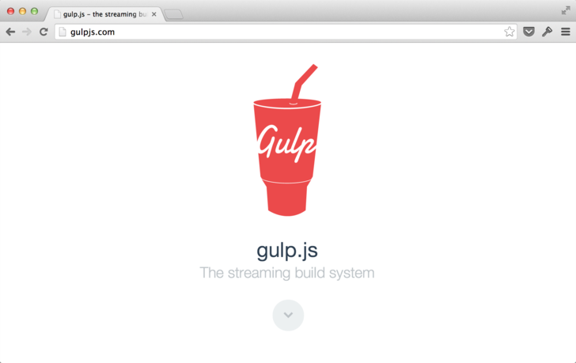
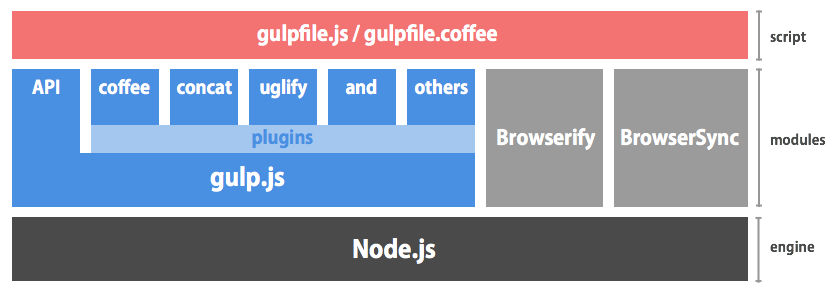

# 1. First, let's make it work.



[gulp.js](http://gulpjs.com/) is a convenient task runner for front-end development and production. It's a fairly new product, only having been around a year since its first commit, but lately people have been hearing about it a lot more from various places. In this series, I will cover different aspects of gulp.js over the span of several articles, from installation to mastery of the program. The range of people who use it has broadened to include not only JavaScript programmers, but also those who deal with HTML/CSS, as well as Photoshop and Illustrator users. This article is also written in hopes that a wide range of users, not limited to programmers, will read and benefit from it.

## What is gulp.js?

Recently, the need to "compile" code has grown, even in Web production with languages like LESS and CoffeeScript. In these cases, commands like:

- LESS: `lessc`
- CoffeeScript: `coffee`
- ...etc etc.

can be used to compile each file individually, but it gets to be tedious memorizing commands and specifying options each and every time. Also, consider the following case when the files are opened.

0. Compile CoffeeScript
0. Combine multiple files into one
0. Minify ((uglify) the JavaScript

When you need to execute multiple processes in a row, a single command is clearly not enough to do the trick. That's where gulp.js comes in. Let's go ahead and take a look at some example settings. (If you'd like to try it yourself, you can [download it here](https://github.com/cognitom/gulp-handbook-recipes/raw/master/download/01-coffee-photos.zip).)

```javascript
gulp.task('coffee', function(){
  return gulp.src('src/*.coffee') // Read the file from the `src` folder
    .pipe(coffee()) // 1. Compile CoffeeScript
    .pipe(concat()) // 2. Combine multiple files into one
    .pipe(uglify()) // 3. Minify (uglify) the JavaScript
    .pipe(gulp.dest('dist/')); // Save to the `dist` folder
});
```

Even if you've never used gulp.js before, I think you can more or less "get" what the above code is doing. This task is executed with the following `gulp` command. (*Some environmental setup is needed first. I'll talk about this further on.)

```bash
$ gulp coffee
```

This way, gulp.js puts multiple processes together into one "recipe." All you have to remember to execute it is the `gulp` command. As long as you share this "recipe" with members of your production team, you can automate tedious tasks without having to worry about unwanted changes due to the environment.

In this article, I will take you from installing gulp.js to actually giving it a spin. Feel free to follow along and experience the simplicity and convenience of gulp.js. (This article assumes you're using Mac OS X 10.9)

> ### Tips: gulp.js and Node.js
> 
> gulp.js uses Node.js as its execution environment, just like most contemporary front-end tools. The "recipe" made by gulp.js is written as a file called `gulpfile.js`, and inside it you can assemble not only plugins for gulp.js, but also modules for Node.js]]. As seen in the figure below, instances of popular tools such as [Browserify](http://browserify.org/) and [BrowserSync](http://www.browsersync.io/) used in tandem with gulp.js are being seen more and more.
> 
> 

## Installing Node.js

In order to make gulp.js work, you need to use <Node.js> as an environment. If you already have that installed, skip ahead to the next section. If you're unsure whether or not it's on your computer, you can use the following command in the terminal to check.

```bash
$ node -v
```

If it's installed, the version number of Node.js will be displayed; if not, you'll get something like "`-bash: node: command not found`". If you have an old version of Node.js, I recommend installing a new one. If you're wondering, the newest version out is currently `v0.10.30` as I'm writing this.


Go to the following URL to install it.


- http://nodejs.org/


> ### Tips: npm -g option, and sudo
> 
> If you're using the official Node.js installer, you'll need to use `sudo` if you want to use `npm` with the `-g` option. Be careful, because in many cases the information published online says nothing about `sudo`.
> 
> However, if you installed it using [nodebrew](https://github.com/hokaccha/nodebrew), even on a Mac, you won't need to use `sudo` for every little thing. In general, whenever you use Node.js, even if it's not for gulp.js, I recommend using `nodebrew`.

## Installing gulp.js

Installation can be done using the `npm` command in the terminal. (npm is the package manager for Node.js.)

```bash
$ sudo npm install -g gulp
```

The `-g` option means a global install. With this, `gulp` commands can be executed from anywhere. Let's try the following command.

```bash
$ gulp -v
```

When you execute this, it'll spit out two version numbers, one for `CLI` and one for `Local`:

```
[16:13:54] CLI version 3.8.6
[16:13:54] Local version undefined
```

The reason the second line comes up `undefined` is because gulp.js hasn't been installed in the current folder. Really, all the CLI version does is run the local gulp.js, so let's set up the local environment for gulp, using the following steps.

> ### Tips: Globals and locals
> 
If you aren't used to Node.js, you may be puzzled at first by the concept of "locals".
> In Node.js, if you install without using the `-g` option, all modules get saved in a "local" folder (the `node_modules` folder). If done this way, you won't be able to use these modules from any other folder.
> 
> ```bash
> $ npm install gulp-concat --save-dev
> ```
> 
> If you use this command, `gulp-concat` will be added to `devDependencies` in `package.json`. Once you've manually written it into 'package.json', it'll effectively be the same as if you'd done an `npm install`.
> 
> On the other hand, when installed using the `-g` option, `gulp` commands can be used from anywhere (globally).

## Writing gulp.js plugins to package.json

Okay, now we're ready, so let's try and make gulp.js work inside an actual project. Here, we'll consider a simple site composed of `index.html` and some CSS. We'll say our file organization is as follows. Using `@import` with CSS takes time to load in the browser, so we'll assume we've optimized that part. (You can download a sample project <here>)


- Project folder
    - src/
        - style.css - Loads other CSS using `@import`
        - base.css
        - theme.css
        - ...
    - index.html


As the default for Node.js, essential modules, including `gulp` files for local use, are written to a file called `package.json`. Conversely, as long as you have `package.json`, `npm` will install all the modules you need automatically, so you can restore your environment at any time.

```javascript
{
  "devDependencies": {
    "gulp": "*",
    "gulp-autoprefixer": "*",
    "gulp-cssimport": "*",
    "gulp-minify-css": "*",
    "gulp-rename": "*"
  },
  "engines": {
    "node": ">=0.10.0"
  },
  "private": true
}
```

Here, `gulp` alone refers to a locally used gulp.js, and the other lines that start with `gulp-` are plugins. There are currently over 700 plugins publicly available, so this is just a small portion of them. Plugins can be found by searching the <plugin page on the official site.> Also, the parts written as a `"*"` can be replaced with a specific version number. If you leave it as `"*"`, the newest version will be used.


Plugin name | what it does
----------|----------
[gulp-autoprefixer](https://www.npmjs.org/package/gulp-autoprefixer) | Automatically adjusts vendor prefixes for CSS
[gulp-cssimport](https://www.npmjs.org/package/gulp-cssimport) | Embeds @import section of CSS
[gulp-minify-css](https://www.npmjs.org/package/gulp-minify-css) | Minifies CSS
[gulp-rename](https://www.npmjs.org/package/gulp-rename) | Renames a file


Once you've saved the above file as `package.json`, type the command

```bash
$ npm install
```

in the root folder of the project. When you do, a folder called `node_modules` will be created, and your essential modules will be placed inside it.


## gulpfile.js is a recipe for tasks.

gulp.js writes tasks to a file called `gulpfile.js`. With this file added, the folder should look like this.


- Project folder
    - dist/ - *Created with `gulp style` (explained further on) *
    - src/ - *CSS is stored here*
    - index.html
    - node_modules/ - *Automatically generated with `npm install` from the previous section*
    - package.json
    - gulpfile.js


The contents of `gulpfile.js` will be simple JavaScript much like the following example. If you're new to Node.js, though, you may not be used to seeing the text at the head of the file. Using `require()` makes it so the external files and modules you specify are read in beforehand. This means that any modules we specified in `package.json` that have already been `npm installed` can be loaded and used here.

```javascript
var gulp         = require('gulp');
var cssimport    = require('gulp-cssimport');
var autoprefixer = require('gulp-autoprefixer');
var minifyCss    = require('gulp-minify-css');
var rename       = require('gulp-rename');

gulp.task('coffee', function(){
  return gulp.src('src/style.css')
    .pipe(cssimport())
    .pipe(autoprefixer('last 2 versions'))
    .pipe(minifyCss())
    .pipe(rename({ extname: '.min.css' }))
    .pipe(gulp.dest('dist/'));
});
```

Now, before you read the rest of this article, try executing the file.

```bash
$ gulp style
```

If it works, there should now be a file called `style.min.css` in the `dist/` folder.

### gulp.task(`task_name`, `function`)

The specified task will use this function. Since the task name is specified from the command line, it can't include spaces, but other than that, naming is relatively unrestricted. You aren't even limited to English characters; you could write something like "整形と圧縮" in Japanese and it would still be fine.

You can also write this using the format `gulp.task(<task name>, <dependent task name>,...], <function>)`, and the main task will be executed only after the dependent task has been executed. For example, you can make it "deploy" but only after doing "coffee" and "css". [cf. Official Doc](https://github.com/gulpjs/gulp/blob/master/docs/API.md#gulptaskname-deps-fn)

### gulp.src(<specified file>)

When specifying the desired file, use a glob string. The following patterns are commonly used for this, and these arrays are perfectly valid.


glob example | meaning
---------|------------
`'src/style.css'` | Exact name of the file
`'src/*.css'` | Anything in the folder 'src' with extension '.css'
`'src/**/*.css'` | Anything with extension '.css' in the folder 'src' or any of its subfolders
`'!src/not-me.css'` | Exclude 'not-me.css'


Also note that the path is specified relative to the root folder of the project. [cf. Official Doc](https://github.com/gulpjs/gulp/blob/master/docs/API.md#gulpsrcglobs-options)

### gulp.dest(`path`)

Just like `gulp.src`, the folder to be output to is specified with a relative path name. If the project folder is located at `/Users/osscafe/my-project/`, it'll be saved as shown below.


specified path | actual path
--------|-----------
Ex. `'./'` | `/Users/osscafe/my-project/`
Ex. `'dist/'`| `/Users/osscafe/my-project/dist/`


### .pipe(`function`)

`gulp.src` and plugins will always return a stream (or a buffer). The `pipe` command is the same as a `|` in Unix, and literally connects one command to the next.

For example, saying `.pipe(rename({ extname: '.min.css' }))` can be read as, "Pipe to the `rename` plugin and add the option to make the extension .min.css." Consult the page for each plugin to see more information on these options. [cf. gulp-rename](https://www.npmjs.org/package/gulp-rename)

## Automatic execution with gulp.watch

Lastly, I'd like to touch on one point about watching files. Let's add the following block of code to the `gulpfile.js` we were just using.

```javascript
gulp.task('watch', function() {
  gulp.watch(['src/*.css'], ['style']);
});
```

If you execute the `gulp watch` command with this in place, your files will be compiled every time they are saved, so you won't have to type the commands to do it every time. [cf. Official Doc](https://github.com/gulpjs/gulp/blob/master/docs/API.md#gulpwatchglob--opts-tasks-or-gulpwatchglob--opts-cb)
